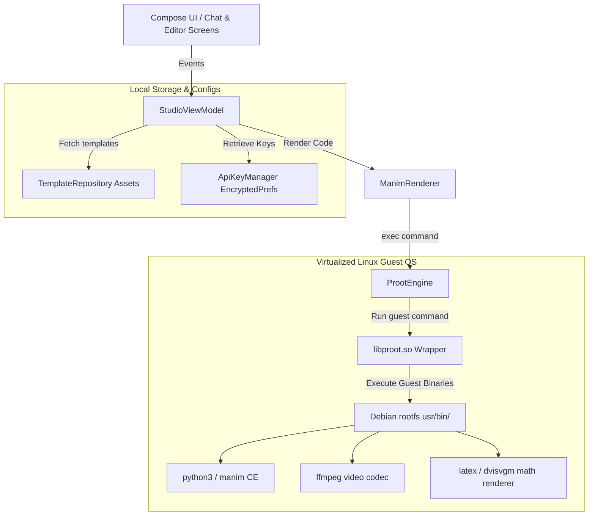

# Manim Studio - Android App Documentation

The **Manim Studio Android Application** is a native Kotlin-based Android project. It runs a full-featured Linux OS environment in user space (PRoot container) to compile and execute **Manim Community Edition** animations directly on-device, without needing external server renderers or root permissions.

---

## 1. Core Architecture

The Android app relies on Jetpack Compose for the UI layer, Kotlin Coroutines/Flows for asynchronous handling, and a native C binary compiler layer for virtual OS containerization.



---

## 2. Directory Structure

The Kotlin source files are organized under the package `com.manimstudio.app`:

```
android/app/src/main/java/com/manimstudio/
+-- ai/
|   +-- ApiKeyManager.kt          # EncryptedSharedPreferences for API keys
|   +-- GroqClient.kt             # Direct Groq API and hosted engine dispatcher
+-- app/
|   +-- data/
|   |   +-- models/               # Application schemas (AppSettings, Theme, ChatMessage)
|   |   +-- PreferencesManager.kt # DataStore settings storage
|   |   +-- TemplateRepository.kt # Loads templates list from local Assets
|   +-- engine/
|   |   +-- BootstrapInstaller.kt # Rootfs tar downloader, extractor & validator
|   |   +-- ManimRenderer.kt      # Manim renderer wrapper + friendly error adapter
|   |   +-- ProotEngine.kt        # User-space rootfs launcher and launcher setup
|   |   +-- SetupViewModel.kt     # VM managing installation stages and checkups
|   +-- ui/
|   |   +-- components/           # Reusable composables (Syntax Editor, Sheets, Tabs)
|   |   +-- screens/              # Top-level composable screens (Studio, Settings, Editor)
|   |   +-- theme/                # Compose layout themes (Color, Motion, Typography)
|   |   +-- AppNavigation.kt      # Router definitions and transitions configurations
|   +-- viewmodel/
|   |   +-- SettingsViewModel.kt  # User preferences VM
|   |   +-- StudioViewModel.kt    # Main chatbot interface & render coordinator
|   +-- MainActivity.kt           # Application launcher Entry Point
|   +-- ManimStudioApp.kt         # Application instance wrapper
```

---

## 3. PRoot Virtual Guest OS Environment

To execute Manim natively, Android requires full packages (Python, FFmpeg, LaTeX, dvisvgm, etc.). Since Android's standard Linux layer is locked, the project embeds a user-space container manager: **PRoot**.

- **Libraries**: Native shared libraries (`libproot.so`, `libproot-loader.so`, `libandroid-shmem.so`, `libtalloc.so`) are distributed under `src/main/jniLibs/arm64-v8a/` and extracted on app installation. Pre-placing the loader as a system-extracted shared library (`libproot-loader.so`) completely eliminates the runtime `chmod` / extraction requirement that triggers security issues on Android. *Note: `libtalloc.so` is patched via `patchelf` at build-time to match Android's flat JNI library naming constraint, which does not allow version suffixes like `.so.2`.*
- **Directory Paths**:
  - `rootfs/`: Mounted guest OS filesystem root (`/`).
  - `home/manim/`: Guest user directory (`/home/manim`), housing Python workspace script outputs.
  - `renders/`: Host folder bound to `/renders` inside the guest to copy final MP4 structures.
  - `proot_tmp`: Environment `/tmp` directory for PRoot's internal lock files, located at `/data/local/tmp/${context.packageName}`.


> [!IMPORTANT]
> **Realpath Path Mismatch**: PRoot's internal `realpath()` resolves `/data/user/0/` to `/data/data/`. Any mismatch in directory paths causes all temporary file/folder operations inside guest scripts to fail with `ENOENT`. To avoid this, the project hardcodes the base directory in `ProotEngine.kt` to `/data/data/${context.packageName}` instead of using `context.filesDir` (which resolves to `/data/user/0/...` on Android).


---

## 4. Bootstrap Installation Flow

When a user launches the app for the first time, `SetupViewModel` guides them through bootstrapping the Linux guest environment:

1. **Manifest Check**: Queries `bootstrap-manifest.json` on GitHub to fetch the latest version specs (size, checksums, target architectures).
2. **Download Package**: Downloads the `bootstrap.tar.gz` archive (approx. 100MB compressed) and performs a **SHA-256 checksum** integrity check.
3. **Extraction**: Runs a native `tar xzf` process to decompress directories into the app's `rootfs` folder.
4. **Validation Check**: Validates the presence of essential guest executables:
   - `/usr/bin/python3`
   - `/usr/bin/pip3`
   - `/usr/bin/ffmpeg`
   - `/usr/bin/latex`
5. **DNS Injection**: Overwrites `/etc/resolv.conf` with Google (`8.8.8.8`) and Cloudflare (`1.1.1.1`) nameservers so Python pip/network libraries function inside the container.
6. **Marker Creation**: Saves a `.installed` file containing the active version number to skip installation on subsequent launches.

---

## 5. View & Screen Lifecycles

### A. Core Navigation Flow ([AppNavigation.kt](file:///C:/Users/Abdulfatai/Documents/manim-studio/android/app/src/main/java/com/manimstudio/app/ui/AppNavigation.kt))
- **`onboarding`**: Asks for the user's name. Saves it and routes to setup.
- **`bootstrap_setup`**: Displays download progress, bytes, and extraction details.
- **`welcome_render`**: Triggers a fast 480p render of a template animation to verify execution before letting the user access the main dashboard.
- **`studio`**: The main interface.

### B. Main App Views
- **Studio Chat Screen** ([ui/screens/StudioScreen.kt](file:///C:/Users/Abdulfatai/Documents/manim-studio/android/app/src/main/java/com/manimstudio/app/ui/screens/StudioScreen.kt)):
  Provides a ChatGPT-like conversational UI. Users enter instructions, generating code cards. Once generated, a bottom sheet launches and displays live Manim rendering logs. When compilation finishes, it replaces logs with an inline **ExoPlayer** video card.
- **Syntax Editor Screen** ([ui/screens/EditorScreen.kt](file:///C:/Users/Abdulfatai/Documents/manim-studio/android/app/src/main/java/com/manimstudio/app/ui/screens/EditorScreen.kt)):
  Includes a custom `SyntaxHighlightedEditor` that colors Python scripts using a regex scanner. Supports editing generated scripts and manually triggering re-compiles.

### C. Security ([ai/ApiKeyManager.kt](file:///C:/Users/Abdulfatai/Documents/manim-studio/android/app/src/main/java/com/manimstudio/ai/ApiKeyManager.kt))
API keys (Groq, Gemini, OpenAI) entered by users are stored securely using **AES-256 GCM EncryptedSharedPreferences** from Android's Security library.

---

## 6. Build Configs & Setup

- **Gradle configuration**: Requires `minSdk = 26` (Oreo) and targeting `targetSdk = 34` or higher.
- **ABI Filter**: Since the guest container relies on ARM assembly translation wrappers, the project locks compile architectures in `build.gradle.kts`:
  ```kotlin
  ndk {
      abiFilters.add("arm64-v8a")
  }
  ```
- **Permissions**: Requires `<uses-permission android:name="android.permission.INTERNET" />` and `ACCESS_NETWORK_STATE` to check Wi-Fi status before downloading the guest OS.
- **Network Config**: Resolves localhost connections to the host development PC (`10.0.2.2:8000`) for development.
