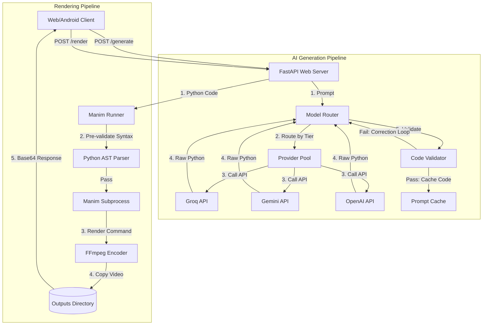

# Manim Studio - Engine Documentation

The **Manim Studio Engine** is a high-performance Python FastAPI backend responsible for orchestrating the core intelligence and rendering capabilities of the application. It translates natural language prompts into executable Manim code, validates the code structure, runs the render pipeline using the Manim Community Edition, and returns the output video/asset packages.

---

## 1. Core Architecture

The engine functions as a localized "shared brain" serving both the Web Interface (via direct localhost HTTP endpoints) and the Android Application (running natively inside a PRoot Linux environment). 



---

## 2. Directory Structure

The engine code is housed under the `engine/` directory:

```
engine/
+-- ai/                       # AI Prompting & Routing Layer
|   +-- gemini_client.py      # Google Gemini integration
|   +-- groq_client.py        # Groq (Llama models) integration
|   +-- openai_client.py      # OpenAI integration
|   +-- model_router.py       # Core router, fallbacks & self-correction loop
|   +-- prompt_builder.py     # System and User prompt compiler
|   +-- provider_pool.py      # API circuit breakers and provider selection
+-- renderer/                 # Execution & Validation Layer
|   +-- code_validator.py     # Static analysis, linting, and auto-correct rules
|   +-- manim_runner.py       # Manim subprocess execution & output packaging
|   +-- preview_renderer.py   # Code preview functions
+-- templates/                # Template Management
|   +-- assets.py             # Pre-configured shape lists
|   +-- library.py            # Built-in animation templates
+-- cache/                    # Disk-based generation caches (JSON format)
+-- outputs/                  # Rendered video files
+-- latex_cache/              # LaTeX compile directory
+-- main.py                   # FastAPI entry point & API Router
+-- setup.py                  # Dev setup script (venv, packages, .env template)
```

---

## 3. Component Deep Dive

### A. FastAPI Server ([main.py](file:///C:/Users/Abdulfatai/Documents/manim-studio/engine/main.py))
- **Role**: Exposes REST endpoints to client interfaces, configures CORS for local Web App accessibility, manages rate-limiting, and mounts static folders for local output inspection.
- **Rate Limiting**: Checks anonymous user IP addresses using an MD5 hash identifier to enforce a daily limit of **20 free generations** (resets at midnight). Requests containing a personal user key bypass this check.
- **Static Mounting**: Mounts the outputs directory to `/outputs` via `StaticFiles` for direct web access.

### B. Model Router ([ai/model_router.py](file:///C:/Users/Abdulfatai/Documents/manim-studio/engine/ai/model_router.py))
- **Model Tiers**:
  | Tier | Criteria | Provider / Model |
  | :--- | :--- | :--- |
  | `fast` | Prompts < 5 words | `groq/llama-3.1-8b-instant`, `gemini-2.0-flash`, `gpt-4o-mini` |
  | `standard` | Prompts 5 to 40 words | `groq/llama-3.3-70b-versatile`, `gemini-2.0-flash`, `gpt-4o-mini` |
  | `smart` | Prompts > 40 words | `groq/llama-3.3-70b-versatile`, `gemini-2.5-pro-preview`, `gpt-4o` |
- **Fallback Flow**: Sequential attempts check personal API keys first. If unavailable, it accesses the developer pool with circuit-breaking.
- **Self-Correction Loop**: When generated code fails static lint check, the engine issues a refinement prompt detailing the exact errors back to the model, supporting up to **2 correction attempts** before yielding output.
- **Disk Cache**: Hashes the incoming prompt with MD5 and saves results in the `cache/` directory to satisfy identical requests in $0\text{ms}$.

### C. Code Validator ([renderer/code_validator.py](file:///C:/Users/Abdulfatai/Documents/manim-studio/engine/renderer/code_validator.py))
- **LaTeX Autocorrection**: Automatically detects raw backslashes in `Tex("...")` or `MathTex("...")` and converts strings to raw `r"..."` literal strings.
- **Scene Class Alignment**: Analyzes use of `.camera.frame` or 3D objects and auto-fixes the base class to `MovingCameraScene` or `ThreeDScene` if the class inherits from the basic `Scene`.
- **Banned Patterns**: Inspects for missing/deprecated APIs, preventing common AI mistakes:
  - `ParametricSurface` $\rightarrow$ Suggests `Surface`.
  - `.intersection(...)` $\rightarrow$ Suggests `line_intersection` utility.
  - `ShowCreation(...)` $\rightarrow$ Suggests `Create`.
  - `FadeInFrom` / `FadeOutAndShift` $\rightarrow$ Suggests modern `FadeIn`/`FadeOut` parameters.
- **Performance Warnings**: Flags large loops (iterations > 50) containing animations (`self.wait()` or `self.add()`) to prevent rendering lockups.

### D. Manim Runner ([renderer/manim_runner.py](file:///C:/Users/Abdulfatai/Documents/manim-studio/engine/renderer/manim_runner.py))
- **Command Dispatcher**: Spins up a `subprocess.run` executing the `manim` CLI utility.
- **Quality Map Configs**:
  | Quality | Flag | FPS | Resolution | Timeout |
  | :--- | :--- | :--- | :--- | :--- |
  | `480p` | `-ql` | 30 | $854 \times 480$ | 90s |
  | `720p` | `-qm` | 30 | $1280 \times 720$ | 180s |
  | `1080p` | `-qh` | 30 | $1920 \times 1080$ | 300s |
  | `2160p` | `-qk` | 30 | $3840 \times 2160$ | 600s |
- **Temp Management**: Generates a unique `tmp_<id>` directory for each job, executes compilation in it to avoid concurrent write collisions, extracts video/image output, copies it to the parent `outputs` folder, and wipes the temp directory.

---

## 4. API Endpoint Reference

### `GET /health`
Verifies server status and environment version.
* **Response**:
  ```json
  { "status": "ok", "version": "1.0" }
  ```

### `POST /generate`
Converts input prompts to executable code.
* **Request Body**:
  ```json
  {
    "prompt": "Create a growing blue circle",
    "template": null,
    "user_keys": {
      "groq": "optional-api-key",
      "gemini": "optional-api-key",
      "openai": "optional-api-key"
    }
  }
  ```
* **Response**:
  ```json
  {
    "code": "from manim import *\nclass SceneClass(Scene):\n...",
    "provider": "groq",
    "model": "llama-3.3-70b-versatile",
    "tier": "standard",
    "cached": false,
    "remaining_today": 19,
    "using_own_key": false
  }
  ```

### `POST /render`
Compiles and renders Manim code.
* **Request Body**:
  ```json
  {
    "code": "from manim import *\nclass GeneratedScene(Scene):...",
    "quality": "720p",
    "format": "mp4"
  }
  ```
* **Response**:
  ```json
  {
    "video": "base64EncodedDataString...",
    "mimeType": "video/mp4",
    "className": "GeneratedScene",
    "filename": "Generated (720p).mp4",
    "size": 524288
  }
  ```

### `GET /pool/status`
Retrieves live developer pool health markers, status counts, and circuit-breaker conditions.

### `GET /templates`
Enumerates available default workspace animation structures.

### `GET /assets`
Lists common assets (e.g. coordinates, grid outlines).

---

## 5. Setup & Local Development

### Prerequisites
1. **Python 3.11** installed and configured on the path.
2. **FFmpeg** installed (system binary must be executable).
3. **LaTeX** (e.g. MiKTeX on Windows or TeX Live on Mac/Linux) if compiling math symbols.

### Running Setup
From the `engine` directory, run the helper setup script:
```bash
python setup.py
```
This automatically:
1. Creates a Python virtual environment (`venv`).
2. Installs all packages specified in [requirements.txt](file:///C:/Users/Abdulfatai/Documents/manim-studio/engine/requirements.txt).
3. Generates a default `.env` file template.

### Starting the Server
Activate your virtual environment and run Uvicorn:
```bash
# Windows
venv\Scripts\activate
uvicorn main:app --reload --port 8000

# macOS / Linux
source venv/bin/activate
uvicorn main:app --reload --port 8000
```
Use `http://localhost:8000/docs` to inspect interactive Swagger documentation.
