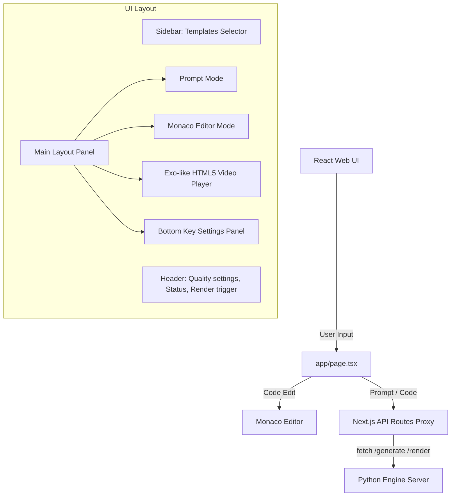

# Manim Studio - Web App Documentation

The **Manim Studio Web Interface** is a modern, responsive React web application built with Next.js 16. It serves as a visual workspace for natural language prompt submission, real-time code editing using the Monaco Editor, template loading, and output video rendering.

---

## 1. Core Architecture

The web app acts as a local console frontend that communicates with the local FastAPI Python engine running on `localhost:8000`.



---

## 2. Directory Structure

The web application files are located under the `web/` directory:

```
web/
+-- app/                      # Next.js App Router Pages & API Routes
|   +-- api/                  # API Proxies (handles CORS & timeouts)
|   |   +-- generate/         # Proxy for /generate (120s timeout)
|   |   +-- render/           # Proxy for /render (600s timeout)
|   |   +-- health/           # Engine status check
|   |   +-- preview/          # Fast code preview
|   |   +-- cleanup/          # Directory cleaner
|   +-- globals.css           # Styling tailwind configuration
|   +-- layout.tsx            # Main layout wrapper
|   +-- providers.tsx         # Theme and Query Client Providers
|   +-- page.tsx              # Main Workspace controller
+-- components/               # React UI Components
|   +-- layout/               # Shell components (Header, Sidebar)
|   +-- ui/                   # Shared design components (Buttons, Card, Select...)
|   +-- workspace/            # Specific workspace elements
|       +-- api-settings.tsx  # Key config editor
|       +-- asset-library.tsx # Saved math elements library
|       +-- code-editor.tsx   # Monaco editor React component
|       +-- prompt-input.tsx  # Voice/Text prompt area
|       +-- video-output.tsx  # Interactive video player and downloads
+-- hooks/                    # Reusable React hooks
+-- lib/                      # Helper libraries, utilities & templates
|   +-- templates.ts          # Default mathematical templates JSON array
+-- public/                   # Static browser assets
+-- scripts/                  # Integration & automation launchers
|   +-- engine.js             # Utility to run python server side-by-side
+-- package.json              # Client packages list
+-- tailwind.config.ts        # Design system styles definition
```

---

## 3. Component Deep Dive

### A. Main Workspace Controller ([app/page.tsx](file:///C:/Users/Abdulfatai/Documents/manim-studio/web/app/page.tsx))
- **Role**: Coordinates global workspace states: active panel (prompt or editor), resolution choice (`480p`, `720p`, `1080p`, `2k`, `4k`), rendering duration timers, video URLs, and engine connectivity checks.
- **Monaco Safe Syncing**: Integrates a module-level variable `_currentCode` updated via `setCurrentCode` and read via `getCurrentCode`. This pattern ensures event handlers inside asynchronous fetch closures never use stale state references.

### B. Workspace Layout Components
- **Header** ([components/layout/header.tsx](file:///C:/Users/Abdulfatai/Documents/manim-studio/web/components/layout/header.tsx)): Houses action triggers like the main **Render** button. Shows rendering indicators (elapsed seconds timer) and checks health status (`online` or `offline`).
- **Sidebar** ([components/layout/sidebar.tsx](file:///C:/Users/Abdulfatai/Documents/manim-studio/web/components/layout/sidebar.tsx)): Enables rapid switching of code contexts. Displays lists of mathematics categories and default boilerplate templates.

### C. Workspace View Components
- **Code Editor** ([components/workspace/code-editor.tsx](file:///C:/Users/Abdulfatai/Documents/manim-studio/web/components/workspace/code-editor.tsx)): Mounts `@monaco-editor/react`. Configures autocomplete triggers, syntax highlight rules for Python code, and updates the shared global code buffer on keypress.
- **Prompt Input** ([components/workspace/prompt-input.tsx](file:///C:/Users/Abdulfatai/Documents/manim-studio/web/components/workspace/prompt-input.tsx)): Text input panel with auto-expanding textareas and suggestion cards for starting mathematical scenes.
- **Video Output** ([components/workspace/video-output.tsx](file:///C:/Users/Abdulfatai/Documents/manim-studio/web/components/workspace/video-output.tsx)): Renders the HTML5 `<video>` player dynamically binding source objects. Includes custom overlay cards for loading states (indicating progress) and triggers for downloading compiled MP4s.

### D. Next.js API Routes Proxy
Because browser client environments encounter cross-origin limitations (CORS) when executing HTTP calls to separate local servers, the web application includes server-side proxy routes under `app/api/...`:
- **Timeout Management**: The generate route ([api/generate](file:///C:/Users/Abdulfatai/Documents/manim-studio/web/app/api/generate/route.ts)) utilizes a `120s` limit, and the render route ([api/render](file:///C:/Users/Abdulfatai/Documents/manim-studio/web/app/api/render/route.ts)) configures a `600s` limit to accommodate complex LaTeX and video operations.

---

## 4. UI Design Aesthetics & Tokens

The application prioritizes a sleek, premium, developer-focused aesthetic:
- **Color Palette**: Dark mode theme by default, blending slate-gray tones (`#0F172A`) with deep neon-blue primary buttons and borders.
- **Interactive States**: Animated transitions driven by `framer-motion` and micro-animations for button presses.
- **Typography**: Clean, readable sans-serif layout (`Geist` / `Inter` fallback) paired with `Fira Code` for coding inputs.

---

## 5. Setup & Local Development

### Prerequisites
Make sure the **FastAPI Engine** is set up and configured first.

### Commands
In the root `web/` directory:

1. **Install Dependencies**:
   ```bash
   npm install
   ```
2. **Start Dev Server**:
   ```bash
   npm run dev
   ```
   *Note: This script triggers `concurrently` to run both the Python FastAPI engine server and the Next.js Turbopack development compiler.*
3. **Build Bundle**:
   ```bash
   npm run build
   ```
4. **Access UI**:
   Open [http://localhost:3000](http://localhost:3000) inside your web browser.
